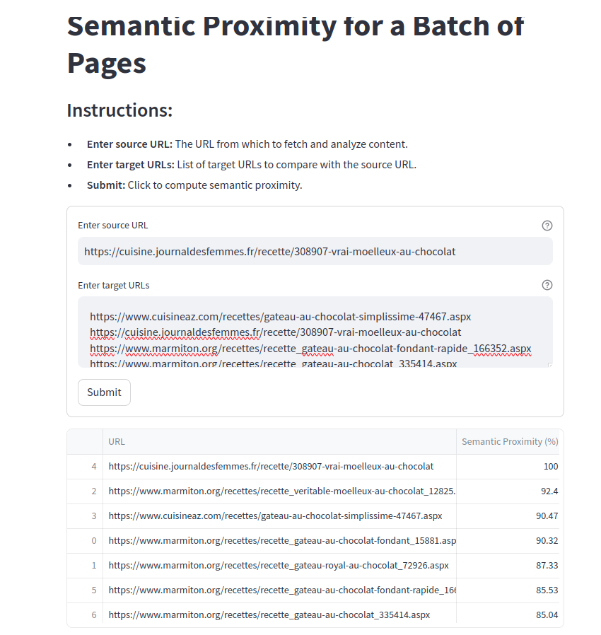

# SEO-Semantic-Proximity

## Overview

SEO-Semantic-Proximity is a tool to measure and analyze the semantic proximity between a source URL and a batch of target URLs. It leverages the power of natural language processing (NLP) to provide insights into the semantic similarity of web pages.

## Features

- **Batch Processing:** Analyze multiple URLs at once.
- **Semantic Analysis:** Uses advanced NLP models to compute similarity.
- **Streamlit Dashboard:** User-friendly interface for easy interaction.
- **Performance Optimized:** Efficient handling of URL fetching and text processing.

## Demo



## Installation

1. **Clone the repository:**
   ```bash
   git clone https://github.com/drogbadvc/SEO-Semantic-Proximity.git
   cd SEO-Semantic-Proximity
   python -m venv venv
   source venv/bin/activate
   pip install -r requirements.txt
   ```

## Usage

1.  **Run the Streamlit dashboard:**
   ```bash
       streamlit run dashboard.py
   ```
2. Enter the source URL and target URLs:
    - Source URL: The URL to compare against target URLs.
    - Target URLs: List of URLs to compare with the source URL.
3. Submit to analyze:
   - Click the Submit button to compute the semantic proximity


